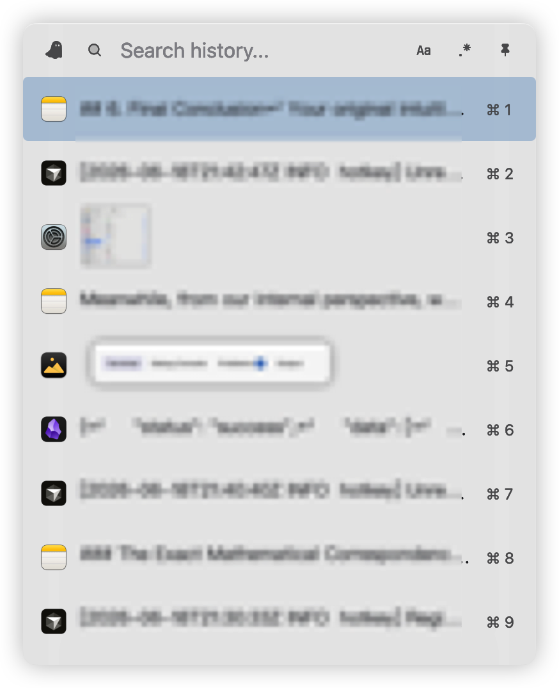
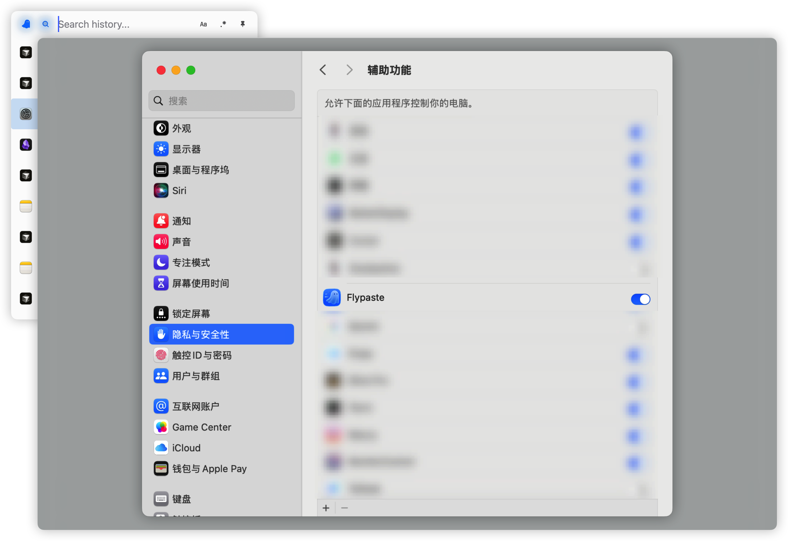
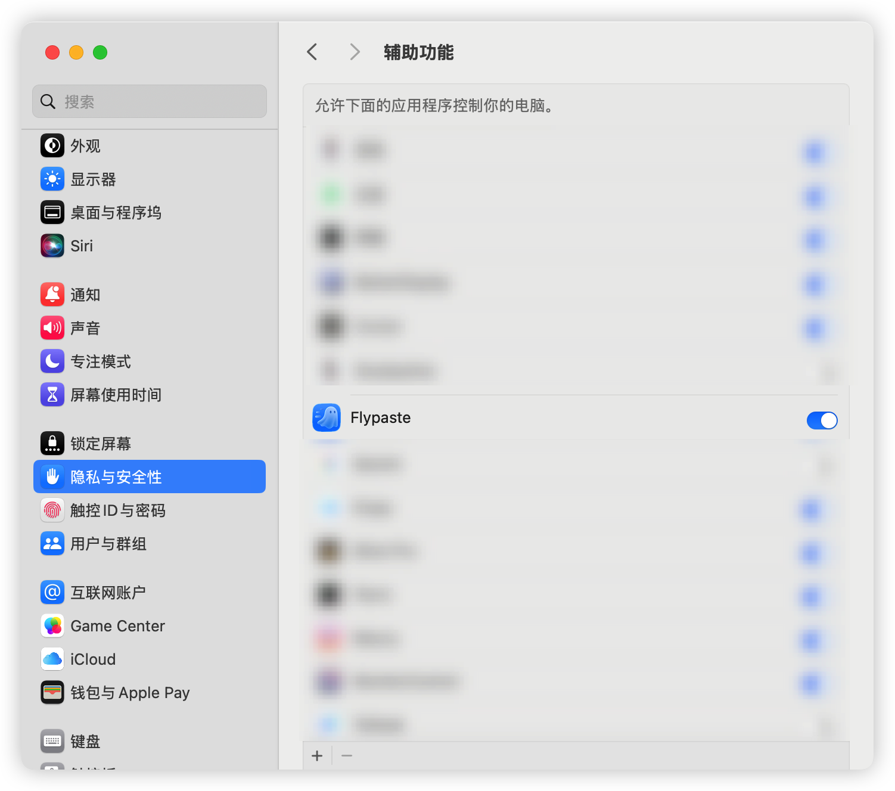
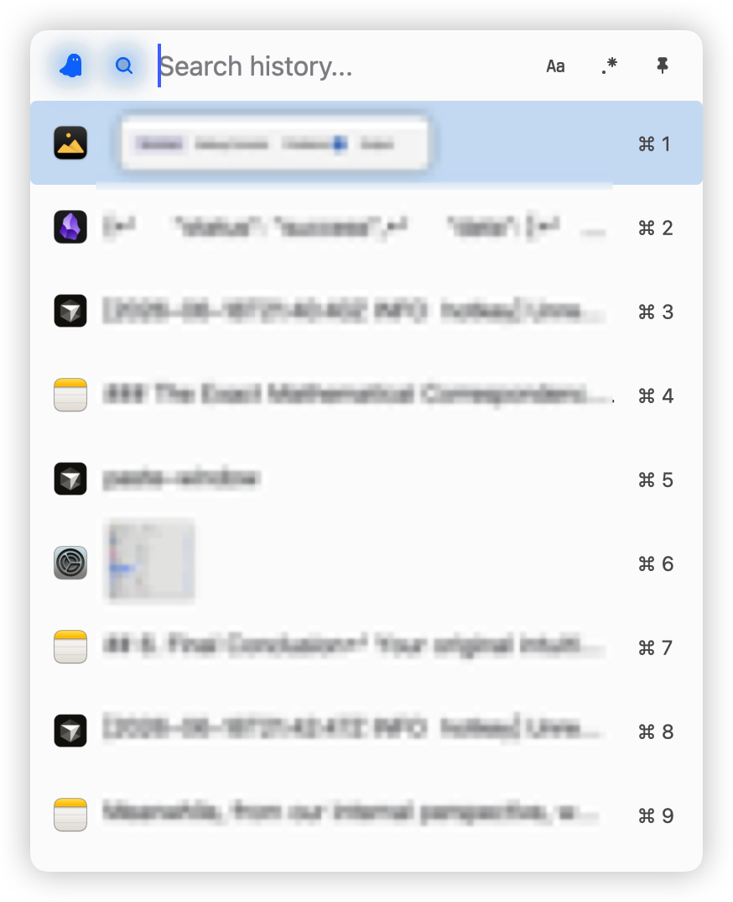

# 技术支持

欢迎来到 Flypaste 技术支持页面。本页包含使用教程与常见问题解答。如果您遇到任何问题或有建议，我们随时为您提供帮助！

---

## 🚀 联系我们

如果你需要进一步的帮助或想报告 bug，可以直接联系开发者：

- **Email**: 1002025363@qq.com

---

## 📖 使用教程

欢迎使用 👻 Flypaste。这是一款专为 macOS 设计的轻量级剪贴板管理工具。Flypaste 会在后台自动记录你的复制历史，并通过快捷面板供你快速调取。

### 1. 核心工作模式

为了最大程度不打断当前工作流，Flypaste 提供两种工作模式：

- **隐身模式（默认）**：
  面板处于悬浮状态，**不会夺取当前应用程序的输入焦点**。在此模式下，当你点击或通过快捷键选中某条记录时，内容会**自动粘贴**到你原先工作的窗口中。
  *(注：由于焦点仍保留在原窗口，此模式下无法进行搜索查询)*

- **聚焦模式**：
  点击面板顶部的搜索框即可进入。此时面板将获取系统的键盘输入焦点，你可以输入文字进行历史记录的搜索，或按 `Space` 空格键预览详细内容。
  *(注：在此模式下，点击任何历史记录只会将其拷贝到剪贴板，**不会**执行粘贴动作)*

> **提示：** 在聚焦模式下，点击面板以外的空白区域，面板会自动释放焦点并返回隐身模式。

### 2. 基础操作指南

- **唤出面板**：默认快捷键为 `Alt + \``（数字 1 左侧的按键）。如需修改，请点击菜单栏 👻 图标，选择 **「设置…」**，在 **「快捷键」** 选项卡中配置。
- **粘贴**：直接点击粘贴项或使用快捷键 `Alt + 1` 到 `Alt + 9` 选中粘贴项。
  - 隐身模式：点击粘贴项后，内容会**自动粘贴**到你原先工作的窗口中。
  - 聚焦模式：点击粘贴项后，内容会**复制**到剪贴板。
- **窗口固定**：使用快捷键 `Cmd + Option + P` 或点击面板右上角的 📌 图标，可将面板固定在屏幕顶层，适用于连续多次粘贴的场景。
- **快捷键**：可以自定义快捷键，包括：
  - 唤出面板
  - 📌 窗口固定
  - Aa 大小写敏感
  - .* 正则表达式

### 3. 搜索与预览

搜索阅览功能需要在聚焦模式下使用，点击搜索框即可进入聚焦模式。聚焦模式下，直接打字即可输入到搜索框中，粘贴历史列表会同步更新。

- **高级搜索规则**：
  - **正则表达式**：默认快捷键 `Cmd + Option + R` 或点击搜索框右侧的 .* 图标开启。
  - **大小写敏感**：默认快捷键 `Cmd + Option + C` 或点击搜索框右侧的 Aa 图标开启。
- **内容预览**：针对长文本或大尺寸图片，鼠标悬浮于粘贴记录上按 `Space`（空格键）可弹出预览窗口，再次按空格键即可关闭。

### 4. 外观设置

点击菜单栏 👻 图标，选择 **「设置…」**，在 **「通用」** 选项卡中可进行以下自定义：

- **界面主题**：支持明亮、黑暗以及跟随系统。
- **透明度控制**：应用支持独立配置「隐身模式」和「聚焦模式」下的面板透明度。

### 5. 存储与数据管理

点击菜单栏 👻 图标，选择 **「设置…」**，在 **「存储」** 选项卡中可对历史数据进行维护：

- **保留期限**：支持对「文本」和「图片」分别设定过期时间。过期数据将在下次启动时自动清理，也可以手动点击按钮清理。
- **重建索引**：若出现搜索结果异常或索引占用空间过多，执行「重建索引」可重新构建索引。
- **清除历史记录**：会清空所有的历史记录，包括文本、图片、索引文件，请**谨慎操作**。

---

## ❓ 常见问题解答

### 1. 为什么 Flypaste 需要「辅助功能」权限？

Flypaste 使用「辅助功能」权限的**唯一原因**是为了替您模拟按下「Command + V」。这样当您点击历史记录时，应用才能自动把内容粘贴到您正在使用的窗口中。没有这个权限，应用将无法替您完成自动粘贴。

### 2. 如何授予辅助功能权限？

1. 打开 Mac 的 **「系统设置」**。
2. 进入 **「隐私与安全性」** -> **「辅助功能」**。
3. 在列表中找到 **Flypaste** 并打开右侧的开关。
   *(如果你发现已经打开但无法粘贴，请尝试选中它并点击下方的 `-` 号删除，然后重新运行应用再次授权)。*

### 3. 为什么点击粘贴项后无法自动粘贴到预期位置？

1. 自动粘贴需要**辅助功能权限**，请前往系统设置的「隐私与安全性」->「辅助功能」中，确保已为 Flypaste 开启权限（参见上文第 1、2 节）。
   
2. 在**聚焦模式**下，无法自动粘贴，请手动 `Cmd + V` 粘贴，或者返回**隐身模式**使用。
   > 提示：在聚焦模式下，👻 图标会亮起。
   

### 4. Flypaste 会上传我的剪贴板数据吗？

绝对不会。Flypaste 100% 离线运行。所有剪贴板历史都安全地保存在您本地硬盘的「应用沙盒」加密环境中。

### 5. 如何删除所有历史记录？

点击屏幕顶部菜单栏的 👻 图标，选择 **「设置…」**，进入 **「存储」** 选项卡，点击 **「清除全部历史…」** 按钮。此操作会删除所有本地记录且无法恢复，完成后 Flypaste 将退出。

### 6. 设置的数据保存期限没有生效？

设置的保存期限会在**下次启动时**自动清理过期数据，而不是立即清理。如需立即清理，请点击 **「设置…」** -> **「存储」** 选项卡中的 **「清理过期数据」** 按钮。

### 7. 快捷键冲突了怎么办？默认的 `Alt + \`` 无法唤出？

如果你发现默认快捷键无响应，通常是被其他软件（如输入法、某些 IDE）占用了。你可以随时点击屏幕顶部菜单栏的 👻 图标，选择 **「设置…」**，然后在 **「快捷键」** 选项卡中重新录制一个属于你自己的全局唤出快捷键。

### 8. 为什么按空格键预览不生效？

空格预览功能需要满足两个条件：

1. 处于**聚焦模式**下（点击搜索框即可进入）。
2. 鼠标悬浮于粘贴记录上。
